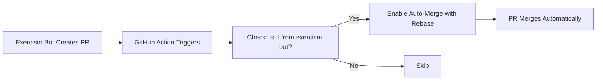

# Auto-Merge Setup for Exercism PRs ✨

This PR adds **automatic merging** for Exercism solution PRs!

## What's New?

🤖 **GitHub Action** that automatically merges PRs from `exercism-solutions-syncer[bot]`

## Files Added

- `.github/workflows/auto-merge-exercism-prs.yml` - GitHub Action workflow
- `.github/GITHUB-ACTION-GUIDE.md` - Complete documentation
- `MERGE-INSTRUCTIONS.md` - Quick start guide
- `merge-all-prs.py` - Python script (backup)
- `merge-all-prs.sh` - Bash script (backup)
- `README-MERGE-SCRIPT.md` - Script documentation

## Quick Start

### Step 1: Merge This PR

Merge PR #43 to enable the GitHub Action.

### Step 2: Trigger the Workflow

Go to [Actions](https://github.com/Se7enseads/Exercism/actions) → **Auto-merge Exercism PRs** → **Run workflow**

This will process all 29 existing open Exercism PRs.

### Step 3: Done! 🎉

Future Exercism PRs will automatically merge when created!

## How It Works

## Benefits

✅ **Zero maintenance** - Set it and forget it  
✅ **Clean history** - Uses rebase strategy  
✅ **Safe** - Only merges verified bot PRs  
✅ **Fast** - Merges immediately when checks pass  
✅ **Ongoing** - Handles all future PRs automatically  

## Documentation

- **Quick start**: `MERGE-INSTRUCTIONS.md`
- **GitHub Action guide**: `.github/GITHUB-ACTION-GUIDE.md`
- **Manual scripts**: `README-MERGE-SCRIPT.md`

## Alternative Options

If you prefer manual control, use the provided scripts:
- `python3 merge-all-prs.py` (recommended)
- `./merge-all-prs.sh`

## Next Steps

1. ✅ Review this PR
2. ✅ Merge PR #43
3. ✅ Go to Actions tab and trigger workflow
4. ✅ Watch 29 PRs get merged automatically
5. 🎉 Enjoy automatic merging forever!

---

**Note**: The manual scripts remain available as backup options if you ever need them.
