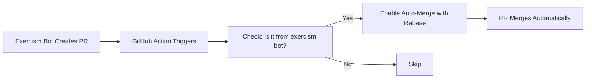

# Auto-Merge Setup for Exercism PRs ✨

This PR adds **automatic merging** for Exercism solution PRs using a GitHub Action!

## What's New?

🤖 **GitHub Action** that automatically merges PRs from `exercism-solutions-syncer[bot]`

## Files Added

- `.github/workflows/auto-merge-exercism-prs.yml` - GitHub Action workflow
- `.github/GITHUB-ACTION-GUIDE.md` - Complete documentation
- `MERGE-INSTRUCTIONS.md` - Quick start guide

## Quick Start

### Step 1: Merge This PR

Merge this PR to enable the GitHub Action.

### Step 2: Trigger the Workflow

Go to [Actions](https://github.com/Se7enseads/Exercism/actions) → **Auto-merge Exercism PRs** → **Run workflow**

This will process all 29 existing open Exercism PRs.

### Step 3: Done! 🎉

Future Exercism PRs will automatically merge when created!

## How It Works



## Benefits

✅ **Zero maintenance** - Set it and forget it  
✅ **Clean history** - Uses rebase strategy  
✅ **Safe** - Only merges verified bot PRs  
✅ **Fast** - Merges immediately when checks pass  
✅ **Ongoing** - Handles all future PRs automatically  
✅ **No local setup** - Runs entirely in GitHub

## Documentation

- **Quick start**: `MERGE-INSTRUCTIONS.md`
- **GitHub Action guide**: `.github/GITHUB-ACTION-GUIDE.md`

## Next Steps

1. ✅ Review this PR
2. ✅ Merge this PR
3. ✅ Go to Actions tab and trigger workflow
4. ✅ Watch 29 PRs get merged automatically
5. 🎉 Enjoy automatic merging forever!

## Manual Alternative

If you need to merge PRs manually, you can use GitHub CLI:

```bash
gh pr list --repo Se7enseads/Exercism --state open
gh pr merge <PR_NUMBER> --repo Se7enseads/Exercism --rebase --auto
```
